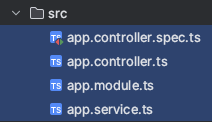
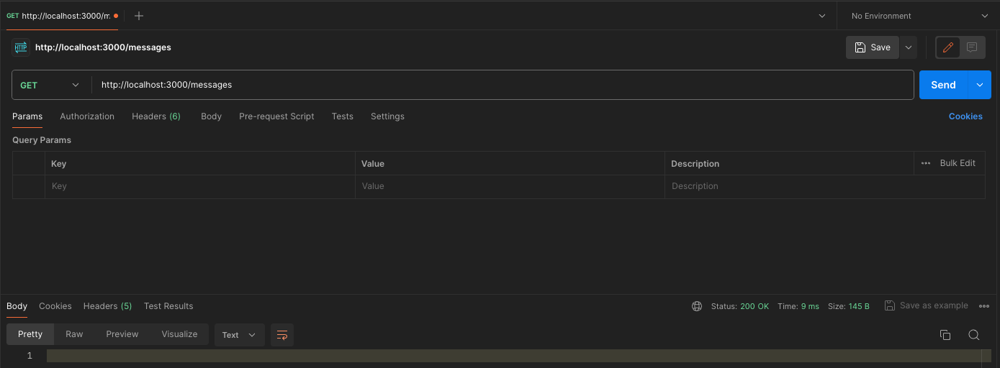
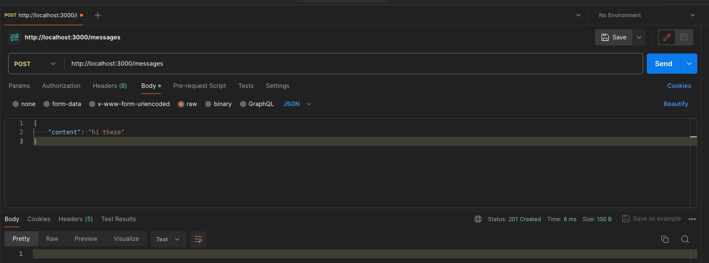
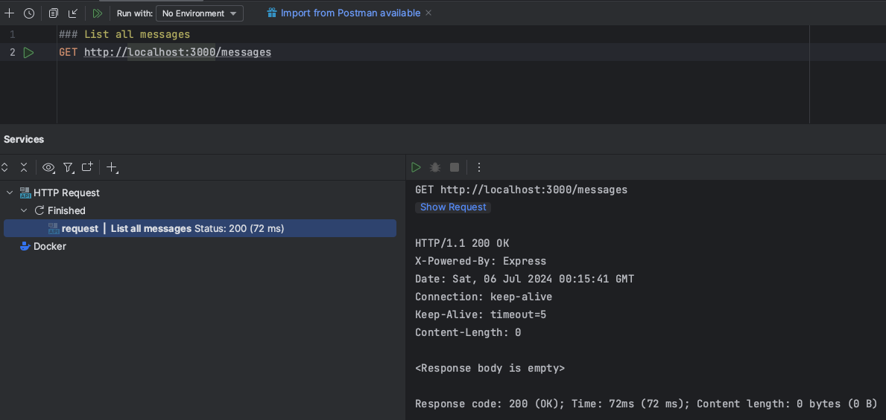
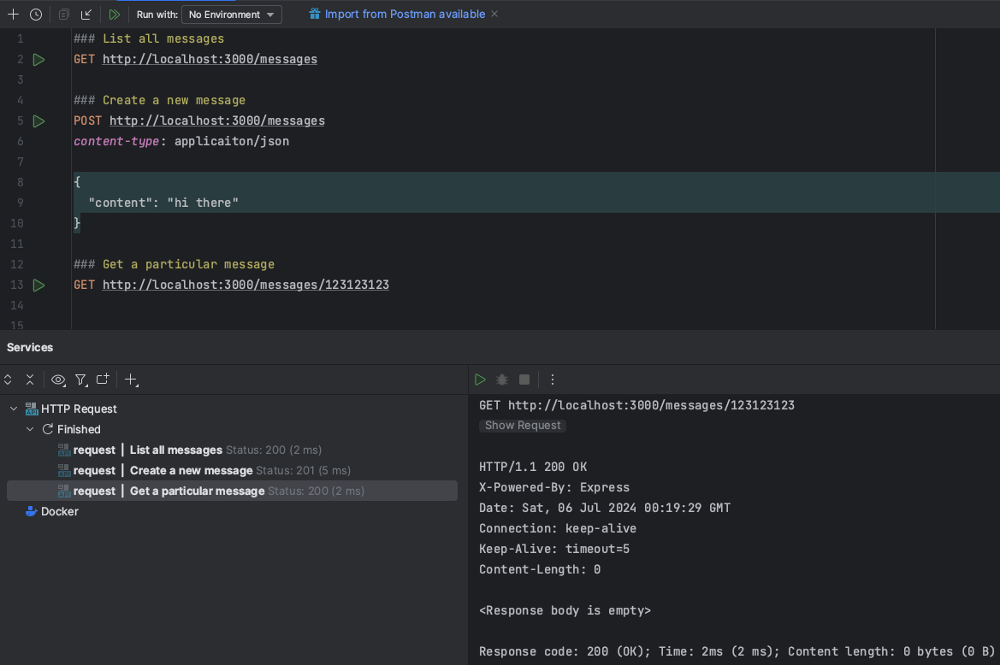
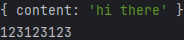
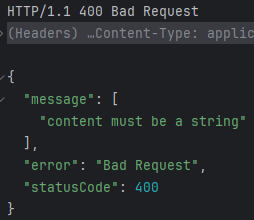

# Nestjs CLI

- 네스트 cli 설치
```shell
sudo npm install -g @nestjs/cli
```

<br/>

- 네스트 프로젝트 생성
```shell
nest new messages
```

<br/>

npm, yarn 등 패키지매니저 선택지가 나오면 npm으로 선택하면 프로젝트 초기 필요한 의존성들을 알아서 설치해 준다.


- package.json
start:dev로 프로젝트를 실행하면 프로젝트의 변경사항이 생길 때마다 자동 재실행이 된다.
```json
    "start:dev": "nest start --watch",
```

<br/>

프로젝트를 dev 모드로 실행해 보자.
```shell
npm run start:dev
```

<br/>

- Nest는 기본값으로 ESLint를 사용한다. ESLint는 명령줄 도구로서 자동으로 프로젝트의 코드를 확인하고 발생가능한 오류나 이슈를 하이라이팅 해준다.
- .eslintrc.js
- ESLint는 호불호가 갈리지만 일단은 비활성화 해놓자. (주석처리)

```js
module.exports = {
  // parser: '@typescript-eslint/parser',
  // parserOptions: {
  //   project: 'tsconfig.json',
  //   tsconfigRootDir: __dirname,
  //   sourceType: 'module',
  // },
  // plugins: ['@typescript-eslint/eslint-plugin'],
  // extends: [
  //   'plugin:@typescript-eslint/recommended',
  //   'plugin:prettier/recommended',
  // ],
  // root: true,
  // env: {
  //   node: true,
  //   jest: true,
  // },
  // ignorePatterns: ['.eslintrc.js'],
  // rules: {
  //   '@typescript-eslint/interface-name-prefix': 'off',
  //   '@typescript-eslint/explicit-function-return-type': 'off',
  //   '@typescript-eslint/explicit-module-boundary-types': 'off',
  //   '@typescript-eslint/no-explicit-any': 'off',
  // },
};
```

<br/>

그럼 이제, Nest CLI가 자동으로 main.ts, app.module.ts, app.controller.ts, app.service.ts 등을 만들어 준다.

<br/>

# nest generate
다시 한번 구조를 정확히 익히기 위해 아래 4개 파일을 삭제해 주자. <br/>



<br/>

Nest CLI를 이용해서 MessagesModule을 만들어 보자. <br/>
만약 messages 모듈을 만들고 싶은 경우 messages만 입력하면 된다.
```shell
nest generate module messages
# CREATE src/messages/messages.module.ts (85 bytes)
```

<br/>

또한 main.ts에 NestFactory에 MessagesModule을 주입해준다.

```typescript
  const app = await NestFactory.create(MessagesModule);
```

<br/>

이번에는 NestCLI를 이용해 컨트롤러를 만들어보자.
```shell
nest generate controller messages/messages --flat
```

<br/>

generate를 이용해 controller를 만들면 이번에는 controller 파일을 만들어 주고, 해당 module에 주입까지 자동으로 해준다. <br/>

명령어를 한번 분석해보자면

```shell
#               클래스 타입   src안의 messages 디렉터리                 클래스 이름    이 명령어를 사용하지 않으면  src/messages/controller/messages.controller.ts 로 생성된다.  (프로젝트 구조 차이)
nest generate controller        messages              /           messages            --flat
```


<br/>

# 라우팅 추가하기
- 이제 생성한 컨트롤러에 다양한 라우트 핸들러를 추가해보자. 간단하게 만들고 2가지 방식으로 테스트 해보자. 
- messages.controller.ts 파일을 참고해서 구현하자.

<br/>

간단하게 Get과 <br/>


<br/>

Post만 테스트 해보자 (Post의 경우 Body는 Body>Raw>JSON에서 넣을 수 있다.) <br/>


<br/>

- 아직 응답 데이터를 넣지 않아 응답 데이터는 나오지 않지만 상태코드 200, 201을 확인하자.
- 이제 다른 방식의 테스트를 진행해 보자.
  - VS Code의 경우 Rest Client나 IntelliJ의 경우 HTTP Client라는 플러그인을 통해 API 테스트가 가능한 파일을 만들어 보자.

<br/>

이렇게 함으로서의 장점은 아래와 같다.
1. API에 대한 문서화를 할 수 있다.
2. 버전 기록을 남길 수 있다.

<br/>

루트 디렉터리에 request.http 파일을 만들고 해당 파일을 참고해서 구현해보자.

<br/>

인텔리제이의 경우 아래와 같이 작성 후, 왼쪽의 플레이 버튼을 누르면 테스트가 되며 아래에 응답 창이 생긴다. <br/>
 <br/>

각각 잘 동작하나 테스트해보자. <br/>


<br/>

## 데코레이터로 요청 데이터에 엑세스하기.
NestJS는 파라미터(패스), 쿼리 스트링, 헤더, 바디 등을 처리하기 위해 다양한 데코레이터를 제공한다.
- @Param()
- @Query()
- @Headers()
- @Body()

<br/>

messages.controller.ts를 구현하고 API 테스트를 진행해보자. 그러고 서버측 콘솔을 확인해보자. <br/>
 <br/>

## Pipe, 요청 데이터 검증하기
- 요청 데이터가 우리가 원하는 아래의 JSON 데이터와 같은지 검증하고 싶다면? 
- Nest.JS에서는 Pipe라는 개념이 존재한다. 즉 컨트롤러로 요청이 오기 전에 Pipe에서 데이터를 검증할 수 있다는 것이다.
```json
{
  "content": "hi there"
}
```

<br/>

Pipe는 직접 구현할 수도 있지만, 보통 ValidationPipe라는 Nest에 내장된 파이프를 사용할 수 있다.

<br/>

1. 일단, main.ts를 참고하여 app.useGlobalPipes()를 적용시켜 준다. 
2. 보통 데이터를 담아 레이어를 이동할 때 사용되는 Data Transfer Object, 즉 DTO를 구현해보자.
3. src/messages/dtos/create-message.dto.ts 파일을 참고해 구현하자.
   - DTO에서, 검증을 해주는 데코레이터를 사용할 것인데 추가적인 라이브러리를 설치해야 한다. (class-validator)
   - 추가적으로, class-transformer라는 라이브러리도 설치하자.


```shell
npm install class-validator class-transformer
```


<br/>

그리고, messages.controller.ts 파일을 참고하여 아래처럼 body 타입에 CreateMessageDto를 넣어주자.
```typescript
@Post()
createMessages(
        // Arguments decorator
        @Body() body: CreateMessageDto
) {
  console.log(body)
}
```

<br/>

- 그 후에 Post /messages에 대해서 다시 API 테스트를 진행해보자.
1. content의 value를 number 등 String이 아닌 타입을 넣어보자.
2. content의 key를 다르게 넣거나, 아예 키를 넣지 말고 요청해보자. 

아래와 같이 400을 응답하며, 서버에서 검증이 진행되고 있다는 것을 알 수 있다. <br/>
  <br/>


## ValidationPipe 동작 과정
서버가 Request를 받게 되면.
1. Validation Pipe가 요청을 받게 된다.
   1. class-transformer 패키지를 사용해 요청에 있는 Body 내용을 DTO 클래스의 인스턴스로 변환한다. (create-message.dto.ts)
   2. class-validator 패키지를 사용해 인스턴스를 실제로 검증하게 된다.
      - 검증에 오류가 있다면 응답을 즉시 클라이언트에게 반환하고
      - 검증에 오류가 없다면 컨트롤러 안에 정의한 요청 핸들러에게 해당 요청을 전달한다.

<br/>

- 여기서 한 가지 생각해 봐야 할 부분이 있다. messages.controller.ts에서 body는 엄밀히 말하자면 JSON 형태인데,
- 특별히 CrateMessageDto 인스턴스로 변환해야 한다는 걸 어떻게 알았을까?

```typescript
@Post()
createMessages(@Body() body: CreateMessageDto) {
    console.log(body)
}
```

<br/>

tsconfig.json으로 돌아와서 Nest.js가 동작하려면 아래 2개의 옵션이 중요한데.
```json
  "emitDecoratorMetadata": true,
  "experimentalDecorators": true,
```

<br/>

- 그중에, emitDecoratorMetadata가 무슨 역할을 하는지 알아볼 필요가 있다.
- CreateMessageDto라는 타입 정보는 타입 스크립트 -> 자바 스크립트로 변환될 때 사라지지만 emitDecoratorMetadata를 true로 두면 사라지지 않는다.

<br/>

- 그렇다면 실제로 타입 스크립트를 자바 스크립트로 변환된 코드를 확인해 보자. (dist/messages/messages.controller.js)
- 아래 코드에서 __metadata("design:paramtypes", [create_message_dto_1.CreateMessageDto]), 부분 덕분에 타입 정보가 JavaScript에서도 지속되는 것이다.
```javascript
__decorate([
   (0, common_1.Post)(),
   __param(0, (0, common_1.Body)()),
   __metadata("design:type", Function),
   __metadata("design:paramtypes", [create_message_dto_1.CreateMessageDto]),
   __metadata("design:returntype", void 0)
], MessagesController.prototype, "createMessages", null);
```

<br/>

## Service, Repository
- Nest CLI에서도 Service와 Repository 생성을 제공하지만, 일단 백지 상태부터 하나씩 구현해보자.
- src/messages/messages.service.ts, src/messages/messages.repository.ts 파일을 생성한다.
- 서비스 파일에 있는 모든 것들은 결국은 리포지토리 안에 있는 코드에 의존하게 된다.
- 리포지토리를 먼저 만들고 그 다음에 서비스를 만들자.
- 메세지는 드라이브에 파일로 저장하는 형태로 일단은 구현해보자.


일단 임시 DB 처럼 사용할 messages.json 파일을 루트디렉터리에 생성하자.

### Repository 구현
messages/messages.repository.ts 파일을 생성하고 구현해보자. (해당 파일 참고)

### Service 구현
messages/messages.service.ts 파일을 생성하고 구현해보자. (해당 파일 참고)

### Controller 구현
messages/messages.controller.ts 파일을 생성하고 구현해보자. (해당 파일 참고)

- Service(Repository 의존)와 Controller(Service 의존)에서 의존하는 클래스를 생성할 때 지금은 생성자에서 수동으로 생성하여 주입해 주고 있지만 추후 의존성 주입 형태로 바꿀 것이다. 
- 모두 구현 되었다면, request.http에서 테스트해 보자. create를 하고 get을 하면 메시지를 응답하는 것을 확인할 수 있고, messages.json 파일을 확인해 보면 데이터가 생긴 것을 확인할 수 있다.

<br/>

## 문제점
지금상황에서 문제점들이 있다.
1. 생성자를 호출하는 부분을 의존성 주입 형태로 바꾸어야 한다.
2. 특정 id를 통해 데이터를 가지고오는 API에 요청할 때 없는 아이디를 입력해도 200 상태 코드를 반환한다.


